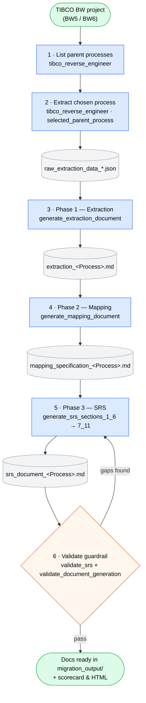

# TIBMigrator — TIBCO BW Reverse / Forward Engineering MCP Server

An AI-driven [Model Context Protocol](https://modelcontextprotocol.io) server that reverse-engineers TIBCO BusinessWorks (BW5/BW6) projects into functional + technical design documents (extraction, mapping, SRS), scopes a whole project for migration effort, and optionally forward-engineers it to a modern platform (Spring Boot, Node.js, FastAPI, .NET, …).

This repo is built to be **portable and shareable**: clone it, run one setup command, connect it from your agent client (VS Code / Claude Code, Cursor, or any MCP client), and go.

**This single README covers everything:**
1. [What you get](#1-what-you-get)
2. [Prerequisites](#2-prerequisites)
3. [How to port / install](#3-how-to-port--install-on-any-machine) — set it up on a new machine
4. [How to connect from an agent client](#4-how-to-connect-from-an-agent-client) — VS Code / Claude Code, Claude CLI, Cursor & other MCP clients, HTTP/SSE
5. [How to use](#5-how-to-use) — skills, the workflow, headless/scripted
6. [The MCP tools](#6-the-mcp-tools)
7. [How configuration is resolved](#7-how-configuration-is-resolved)
8. [Troubleshooting](#8-troubleshooting)
9. [Sharing / moving the repo](#9-sharing--moving-the-repo)

> For an in-depth runbook of the three ways to *run* the server (stdio / HTTP-SSE / headless), see [`RUN_MCP_SERVER.md`](RUN_MCP_SERVER.md). This README is the single entry point; that file is the deeper reference.

---

## 1. What you get

| Piece | Path | Purpose |
|-------|------|---------|
| **MCP server** | `src/tibmigrator/` | The tool implementation (the MCP tools in §6) |
| **MCP config** | `.mcp.json` | Registers the server with Claude Code (stdio). Regenerated by `setup.ps1` |
| **Setup script** | `setup.ps1` | Creates venv, installs deps, verifies import, writes machine-correct `.mcp.json` |
| **HTTP/SSE launcher** | `start_server.ps1` | Runs the server as a standalone HTTP/SSE service for non-Claude-Code clients |
| **Headless client** | `tools/tib_mcp_client.py` | Call any tool from the command line (batch/CI, no chat session) |
| **Skills** | `.claude/skills/` | Slash-command workflows: `tibco-reverse-engineer`, `tibco-inventory`, `tibco-validate`, `tibco-forward-engineer` |
| **Agent** | `.claude/agents/tibco-migrator.md` | Subagent that drives the whole flow end-to-end |
| **Methodology prompts** | `tibco-reverse-engineering-prompt.MD`, `forward_engineering_prompt_template.md` | The methodology the AI follows |

Because the skills and agent live under `.claude/`, they travel with the repo and are shared automatically with anyone who clones it. Generated documents land in **`migration_output/`** at the repo root.

---

## 2. Prerequisites

- **Windows** with **PowerShell** (the setup/launch scripts are PowerShell).
- **Python 3.8+** on `PATH` (the `py` launcher is preferred; plain `python` also works). `setup.ps1` builds an isolated venv at `src\.venv` — it does not touch your global Python.
- **An MCP client**, one of:
  - **VS Code + the Claude Code extension** (recommended — zero extra config, reads `.mcp.json`), or
  - the **`claude` CLI** (optional, needs Node.js: `npm i -g @anthropic-ai/claude-code`), or
  - **Cursor / Windsurf / any MCP-capable client** (paste the stdio or SSE config from §4).

No global installs beyond Python — everything else is vendored into the venv by `setup.ps1`.

---

## 3. How to port / install (on any machine)

The repo is self-contained. To stand it up on a fresh machine or after cloning:

```powershell
# 1. Get the code
git clone <your-repo-url> ReverseEngineeringMCP
cd ReverseEngineeringMCP

# 2. One-time setup: creates the venv, installs deps, verifies the import,
#    and (re)generates .mcp.json with paths correct for THIS machine.
./setup.ps1                    # add -RemoveConflicting to delete a stale user-site install
```

What `setup.ps1` does (idempotent — safe to re-run):
1. Finds a base Python 3.8+.
2. Creates the venv at `src\.venv` (skips if present).
3. Installs `requirements.txt` into the venv.
4. Verifies `import tibmigrator.server` succeeds.
5. Regenerates `.mcp.json` with **this machine's absolute paths** and the required env vars.

> **Why re-run setup when you move the repo?** `.mcp.json` holds absolute paths (the venv interpreter, `cwd`, `PYTHONPATH`, workspace). Moving the folder or cloning to a new path invalidates them — `setup.ps1` rewrites them correctly. This is the "porting" step.

**Verify it imports** (optional sanity check):

```powershell
$env:PYTHONPATH="$PWD\src"; $env:PYTHONUTF8="1"; $env:TIBMIGRATOR_BYPASS_LICENSE="true"
.\src\.venv\Scripts\python.exe -c "import tibmigrator.server; print('import-ok')"
```

---

## 4. How to connect from an agent client

The server runs over **stdio** (the client launches it) or **HTTP/SSE** (you launch it, the client connects by URL). Pick the section for your client.

### 4a. VS Code + Claude Code extension (recommended)

Zero extra configuration — the extension reads the project `.mcp.json` that `setup.ps1` generated.

1. Open the **`ReverseEngineeringMCP` folder** in VS Code (with the Claude Code extension installed).
2. In the Claude Code chat panel, run:
   ```
   /mcp
   ```
   Approve / connect the **tibmigrator** server (one-time approval for project MCP servers).
3. You now have `mcp__tibmigrator__*` tools and the `/tibco-*` skills. Jump to [§5 How to use](#5-how-to-use).

> Reconnect via `/mcp` whenever `.mcp.json` changes (e.g. after re-running `setup.ps1`).

### 4b. Claude CLI

Same `.mcp.json`, terminal instead of the IDE.

```powershell
cd C:\ReverseEngineeringMCP
claude            # launches in this folder; /mcp to connect tibmigrator
```

The CLI is optional and needs Node.js (`npm i -g @anthropic-ai/claude-code`). The VS Code extension is the full product — you don't need the CLI.

### 4c. Cursor, Windsurf & other stdio MCP clients

These clients accept an MCP server definition. Paste this block into the client's MCP config (e.g. Cursor's `~/.cursor/mcp.json` or a project `.vscode/mcp.json`), adjusting the absolute path to where you cloned the repo:

```json
{
  "mcpServers": {
    "tibmigrator": {
      "command": "C:\\ReverseEngineeringMCP\\src\\.venv\\Scripts\\python.exe",
      "args": ["-m", "tibmigrator.server", "--mode", "stdio"],
      "cwd": "C:\\ReverseEngineeringMCP",
      "env": {
        "PYTHONPATH": "C:\\ReverseEngineeringMCP\\src",
        "PYTHONUTF8": "1",
        "TIBMIGRATOR_BYPASS_LICENSE": "true",
        "TIBMIGRATOR_WORKSPACE": "C:\\ReverseEngineeringMCP"
      }
    }
  }
}
```

This is exactly what `setup.ps1` writes to `.mcp.json` — copy that file's contents if you prefer. All four `env` entries matter (see [§7](#7-how-configuration-is-resolved)).

> Skills (`/tibco-*`) are a Claude Code feature. From other clients you call the **tools by name** (`overall_scope`, `tibco_reverse_engineer`, …) instead.

### 4d. HTTP / SSE — for remote or non-stdio clients

Run the server as a standalone service and connect any client by URL:

```powershell
cd C:\ReverseEngineeringMCP
./start_server.ps1                       # defaults: host 0.0.0.0, port 6474
./start_server.ps1 -ServerPort 7000      # custom port
```

Endpoints: server `http://localhost:6474` · SSE `http://localhost:6474/sse` · health `http://localhost:6474/health`. Stop with `Ctrl+C`.

Point an MCP client at the SSE endpoint:

```json
{ "mcpServers": { "tibmigrator": { "url": "http://localhost:6474/sse" } } }
```

Full HTTP/SSE details (manual command, env vars) are in [`RUN_MCP_SERVER.md`](RUN_MCP_SERVER.md) §B.

---

## 5. How to use

### Interactive (skills in Claude Code)

After connecting (§4a/§4b), pick the skill for the task:

- **`/tibco-inventory`** — whole-project complexity / effort scope report (wraps `overall_scope`). Writes `migration_output/overall_migration_scope.md` with complexity bands, integration-pattern mix, a reuse-leverage summary, and **Mermaid dependency flow charts** (program-level + library-level) that GitHub renders automatically.
- **`/tibco-reverse-engineer`** — analyse one interface → extraction + mapping + SRS docs (auto-runs a fast deterministic validation at the end).
- **`/tibco-validate`** — independently re-validate the current interface's SRS with the deeper **AI cross-check** on (8-dimension scorecard + HTML).
- **`/tibco-forward-engineer`** — migrate a reverse-engineered interface to a target platform (technical design → migrated code).

For reverse engineering / scoping, provide:
- `project_dir` — absolute path to the TIBCO project root
- `bw_version` — `BW5` (`.process`) or `BW6` (`.bwp`)
- output goes to `migration_output/` in this repo (the configured workspace)

**The workflow `/tibco-reverse-engineer` runs:**



1. **List** parent processes — `tibco_reverse_engineer(project_dir, bw_version)`.
2. **Extract** the chosen process — `tibco_reverse_engineer(..., selected_parent_process=...)` → writes `raw_extraction_data_*.json`.
3. **Phase 1** `generate_extraction_document` → `extraction_<Process>.md`.
4. **Phase 2** `generate_mapping_document` → `mapping_specification_<Process>.md`.
5. **Phase 3** `generate_srs_sections_1_6` + `generate_srs_sections_7_11` → `srs_document_<Process>.md`.
6. **Validate (guardrail)** `validate_srs(ai="none")` → scorecard + HTML, then `validate_document_generation`. For a deeper AI-cross-checked pass, run `/tibco-validate`.

> **These tools are AI-driven.** Each `generate_*` tool returns `raw_data` + `instructions` + `output_file`; the AI generates the markdown and writes the file. Calling the tool alone does not produce a document. (`overall_scope` is the exception — it writes its own file.)

### Headless / scripted (automation, CI, regenerating a doc)

The headless client starts the server over stdio, calls one tool, and prints/saves the result. It resolves the venv and `src/` itself, so it works from any directory.

```powershell
# List BW5 parent processes
.\src\.venv\Scripts\python.exe tools\tib_mcp_client.py tibco_reverse_engineer `
  --args '{"project_dir":"C:/path/to/tibco","bw_version":"BW5"}'

# Extract a selected process
.\src\.venv\Scripts\python.exe tools\tib_mcp_client.py tibco_reverse_engineer `
  --args '{"project_dir":"C:/path/to/tibco","selected_parent_process":"MyProc","bw_version":"BW5"}'

# Whole-project scope report (writes its own file)
.\src\.venv\Scripts\python.exe tools\tib_mcp_client.py overall_scope `
  --args '{"project_dir":"C:/path/to/tibco","output_file":"C:/ReverseEngineeringMCP/migration_output/overall_migration_scope.md","bw_version":"BW5"}'

# Validate generated docs
.\src\.venv\Scripts\python.exe tools\tib_mcp_client.py validate_document_generation
```

Flags: `--args '<json>'` or `--args-file f.json`; `--out result.json` to save; `--workspace DIR` to change where `migration_output` is read/written (default: repo root).

---

## 6. The MCP tools

| Tool | Role |
|------|------|
| `tibco_reverse_engineer` | List parent processes; extract a selected process hierarchy |
| `overall_scope` | Whole-project complexity/inventory + dependency report (writes its own file) |
| `process_list` | List processes |
| `generate_extraction_document` | Phase 1 data + instructions |
| `generate_mapping_document` | Phase 2 data + instructions |
| `generate_srs_sections_1_6` / `generate_srs_sections_7_11` | Phase 3 (SRS) data + instructions |
| `validate_srs` | Independent SRS validation (8-dimension scorecard + HTML; optional AI cross-check) |
| `validate_document_generation` | Confirm docs are comprehensive (not stubs) |
| `extract_sample_structures` | Sample XML/JSON/XSD/SQL into `samples/` |
| `export_mappings_to_csv` | Export mappings to CSV |
| `generate_technical_design` / `generate_migrated_code` | Forward engineering |
| `validate_forward_engineering` | Validate forward-engineering output |

---

## 7. How configuration is resolved

- **Imports:** `PYTHONPATH=<repo>/src` makes the `tibmigrator` package importable from any working directory.
- **Workspace (where `migration_output` lives):** every workspace-aware tool resolves in this order — `TIBMIGRATOR_WORKSPACE` env → current working directory → parent directories → package directory. `.mcp.json` sets both `cwd` and `TIBMIGRATOR_WORKSPACE` to the repo root so all tools agree.
- **Encoding:** `PYTHONUTF8=1` keeps the server's emoji-laden output from crashing on Windows' default `cp1252` codec.
- **License:** `TIBMIGRATOR_BYPASS_LICENSE=true` runs without the optional license module.

---

## 8. Troubleshooting

| Symptom | Cause / Fix |
|---------|-------------|
| Tools don't appear in the client | Run `/mcp` and connect/approve `tibmigrator` (Claude Code). For other clients, confirm the stdio/SSE config from §4 and restart the client. Config changes require reconnecting. |
| `bad magic number in 'tibmigrator'` | A user-site copy compiled for a different Python version shadows the source. Run `./setup.ps1 -RemoveConflicting`, and ensure the config points at `src\.venv\Scripts\python.exe`. |
| `'charmap' codec can't encode character` | Missing `PYTHONUTF8=1`. Re-run `setup.ps1` to regenerate `.mcp.json`; for manual/SSE runs export it first. |
| `Raw data file not found` (generate/validate) | The extract step (`tibco_reverse_engineer` with `selected_parent_process`) hasn't run for this workspace, or `TIBMIGRATOR_WORKSPACE` doesn't point at the folder containing `migration_output`. |
| Port 6474 in use (SSE) | `./start_server.ps1 -ServerPort <free-port>`. |
| `claude` not recognized (terminal) | The CLI is optional and needs Node.js (`npm i -g @anthropic-ai/claude-code`). The VS Code extension is the full product — you don't need the CLI. |
| Mermaid charts not rendering | They're emitted as plain ```` ```mermaid ```` blocks — GitHub renders them natively. VS Code's preview needs the *Markdown Preview Mermaid* extension. |

---

## 9. Sharing / moving the repo

`.gitignore` excludes `.venv/`, `migration_output/`, and the generated `*.enc` prompts — all reproducible. A fresh clone needs only `./setup.ps1`. The plaintext prompt files at the repo root (`tibco-reverse-engineering-prompt.MD`, `forward_engineering_prompt_template.md`) act as the runtime fallback when the encrypted prompts aren't present, so sharing via git works without the `.enc` files.

> `.mcp.json` contains machine-specific absolute paths. `setup.ps1` regenerates it per machine — so after cloning or moving the folder, re-run setup (the "port" step in §3) before connecting.
