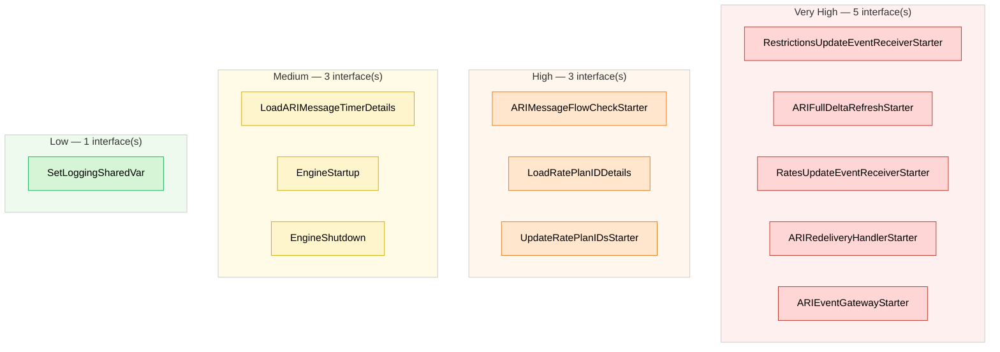

# TIBCO BW Migration – Overall Scope & Complexity Inventory

**Project root:** `C:\ReverseEngineeringMCP\TibcoSource\PCSEngineARIService`  
**BW version:** BW5  
**Generated:** 2026-06-17 11:04:24  
**Total interfaces / batch processes:** 12

> Complexity bands are derived from measured metrics (activities, subprocesses, transitions, transformations, loops, integration technologies). The exact rubric is documented in the appendix and can be recalibrated. Trigger 'kind' and 'integration pattern' detection is heuristic and should be confirmed during detailed analysis.

## 1. Executive summary

### Complexity distribution

| Complexity | Count | % of total |
|---|---:|---:|
| Very High | 5 | 42% |
| High | 3 | 25% |
| Medium | 3 | 25% |
| Low | 1 | 8% |

### Interface type

| Type | Count |
|---|---:|
| Interface (event / request) | 4 |
| Batch / scheduled | 4 |
| Lifecycle (startup/shutdown) | 4 |

### Integration pattern

| Integration pattern | Count | % of total |
|---|---:|---:|
| Lifecycle (startup/shutdown) | 4 | 33% |
| Message-driven (one-way) | 3 | 25% |
| File / Batch transfer | 2 | 17% |
| Scheduled batch (DB/ETL) | 1 | 8% |
| Polling / Scheduled | 1 | 8% |
| Publish-Subscribe | 1 | 8% |

**Total business transformation/mapping activities across project:** 36

### Integration technology footprint

| Technology | Interfaces using it |
|---|---:|
| Messaging (JMS/EMS) | 11 |
| Transformation/Mapping | 8 |
| HTTP / REST | 5 |
| Java code | 5 |
| Web service (SOAP/WSDL) | 2 |
| Database (JDBC/SQL) | 2 |
| File / FTP | 2 |
| Email | 1 |

### Reuse leverage

**11** process(es) are shared library code reused across 2+ interfaces. Migrating these **once** yields the most leverage - `LoggingProxy` alone is reused by **10** of **12** interfaces. Build the shared components first, then the interface-specific logic on top.

| Migrate-first shared component | Reused by (interfaces) |
|---|---:|
| LoggingProxy | 10 |
| ExceptionHandlingProxy | 8 |
| LogInfoOrDebugProxy | 6 |
| AuditLogPublisher | 5 |
| GenerateAuroraAlert | 5 |

> Full reuse graph in Section 3. Reuse count is a leverage indicator, not added to the complexity score.

## 2. Consolidated interface inventory

| # | Interface / batch | Type | Integration pattern | Complexity | Score | Activities | Subprocesses | Transitions | Transformations | Loops | Shared deps | Integration tech |
|---:|---|---|---|---|---:|---:|---:|---:|---:|---:|---:|---|
| 1 | RestrictionsUpdateEventReceiverStarter | Interface (event / request) | Message-driven (one-way) | Very High | 262.5 | 107 | 13 | 129 | 9 | 4 | 11 | HTTP / REST, Java code, Messaging (JMS/EMS), Transformation/Mapping, Web service (SOAP/WSDL) |
| 2 | ARIFullDeltaRefreshStarter | Batch / scheduled | File / Batch transfer | Very High | 261.5 | 108 | 13 | 117 | 4 | 8 | 8 | Database (JDBC/SQL), File / FTP, HTTP / REST, Java code, Messaging (JMS/EMS), Transformation/Mapping |
| 3 | RatesUpdateEventReceiverStarter | Interface (event / request) | Message-driven (one-way) | Very High | 252.0 | 104 | 12 | 124 | 8 | 4 | 11 | HTTP / REST, Java code, Messaging (JMS/EMS), Transformation/Mapping, Web service (SOAP/WSDL) |
| 4 | ARIRedeliveryHandlerStarter | Batch / scheduled | Scheduled batch (DB/ETL) | Very High | 191.5 | 80 | 8 | 85 | 3 | 5 | 7 | Database (JDBC/SQL), HTTP / REST, Java code, Messaging (JMS/EMS), Transformation/Mapping |
| 5 | ARIEventGatewayStarter | Interface (event / request) | Message-driven (one-way) | Very High | 142.5 | 58 | 7 | 73 | 2 | 2 | 6 | HTTP / REST, Java code, Messaging (JMS/EMS), Transformation/Mapping |
| 6 | ARIMessageFlowCheckStarter | Batch / scheduled | Polling / Scheduled | High | 74.5 | 21 | 2 | 27 | 6 | 1 | 2 | Email, Messaging (JMS/EMS), Transformation/Mapping |
| 7 | LoadRatePlanIDDetails | Lifecycle (startup/shutdown) | Lifecycle (startup/shutdown) | High | 52.5 | 16 | 2 | 23 | 2 | 0 | 2 | File / FTP, Messaging (JMS/EMS), Transformation/Mapping |
| 8 | UpdateRatePlanIDsStarter | Batch / scheduled | File / Batch transfer | High | 47.0 | 15 | 2 | 22 | 2 | 0 | 2 | Messaging (JMS/EMS), Transformation/Mapping |
| 9 | LoadARIMessageTimerDetails | Lifecycle (startup/shutdown) | Lifecycle (startup/shutdown) | Medium | 28.5 | 11 | 1 | 17 | 0 | 0 | 1 | Messaging (JMS/EMS) |
| 10 | EngineStartup | Lifecycle (startup/shutdown) | Lifecycle (startup/shutdown) | Medium | 23.0 | 8 | 1 | 12 | 0 | 0 | 1 | Messaging (JMS/EMS) |
| 11 | EngineShutdown | Lifecycle (startup/shutdown) | Lifecycle (startup/shutdown) | Medium | 20.0 | 6 | 1 | 10 | 0 | 0 | 1 | Messaging (JMS/EMS) |
| 12 | SetLoggingSharedVar | Interface (event / request) | Publish-Subscribe | Low | 2.0 | 1 | 0 | 2 | 0 | 0 | 0 | — |

## 3. Dependencies & shared library code

A *shared / library* process is a (sub)process reused by two or more interfaces (i.e. one interface referenced as library code by others). High reuse means a single migrated component can serve many interfaces - prioritise these.

### 3.1 Shared / library processes (by reuse)

| Shared / library process | Reuse (interfaces) | Used by |
|---|---:|---|
| LoggingProxy | 10 | ARIEventGatewayStarter, ARIFullDeltaRefreshStarter, ARIMessageFlowCheckStarter, ARIRedeliveryHandlerStarter, EngineShutdown, EngineStartup, LoadRatePlanIDDetails, RatesUpdateEventReceiverStarter, RestrictionsUpdateEventReceiverStarter, UpdateRatePlanIDsStarter |
| ExceptionHandlingProxy | 8 | ARIEventGatewayStarter, ARIFullDeltaRefreshStarter, ARIMessageFlowCheckStarter, ARIRedeliveryHandlerStarter, LoadRatePlanIDDetails, RatesUpdateEventReceiverStarter, RestrictionsUpdateEventReceiverStarter, UpdateRatePlanIDsStarter |
| LogInfoOrDebugProxy | 6 | ARIEventGatewayStarter, ARIFullDeltaRefreshStarter, ARIRedeliveryHandlerStarter, LoadARIMessageTimerDetails, RatesUpdateEventReceiverStarter, RestrictionsUpdateEventReceiverStarter |
| AuditLogPublisher | 5 | ARIEventGatewayStarter, ARIFullDeltaRefreshStarter, ARIRedeliveryHandlerStarter, RatesUpdateEventReceiverStarter, RestrictionsUpdateEventReceiverStarter |
| GenerateAuroraAlert | 5 | ARIEventGatewayStarter, ARIFullDeltaRefreshStarter, ARIRedeliveryHandlerStarter, RatesUpdateEventReceiverStarter, RestrictionsUpdateEventReceiverStarter |
| XMLtoJSON | 5 | ARIEventGatewayStarter, ARIFullDeltaRefreshStarter, ARIRedeliveryHandlerStarter, RatesUpdateEventReceiverStarter, RestrictionsUpdateEventReceiverStarter |
| PublishToDeliveryTopic | 4 | ARIFullDeltaRefreshStarter, ARIRedeliveryHandlerStarter, RatesUpdateEventReceiverStarter, RestrictionsUpdateEventReceiverStarter |
| ErrorLog | 3 | ARIFullDeltaRefreshStarter, RatesUpdateEventReceiverStarter, RestrictionsUpdateEventReceiverStarter |
| GetReferenceCacheData | 2 | RatesUpdateEventReceiverStarter, RestrictionsUpdateEventReceiverStarter |
| JSONtoXML | 2 | RatesUpdateEventReceiverStarter, RestrictionsUpdateEventReceiverStarter |
| SuccessLog | 2 | RatesUpdateEventReceiverStarter, RestrictionsUpdateEventReceiverStarter |

### 3.3 Dependencies per interface

| Interface | Shared / library deps used | Count |
|---|---|---:|
| RestrictionsUpdateEventReceiverStarter | AuditLogPublisher, ErrorLog, ExceptionHandlingProxy, GenerateAuroraAlert, GetReferenceCacheData, JSONtoXML, LogInfoOrDebugProxy, LoggingProxy, PublishToDeliveryTopic, SuccessLog, XMLtoJSON | 11 |
| ARIFullDeltaRefreshStarter | AuditLogPublisher, ErrorLog, ExceptionHandlingProxy, GenerateAuroraAlert, LogInfoOrDebugProxy, LoggingProxy, PublishToDeliveryTopic, XMLtoJSON | 8 |
| RatesUpdateEventReceiverStarter | AuditLogPublisher, ErrorLog, ExceptionHandlingProxy, GenerateAuroraAlert, GetReferenceCacheData, JSONtoXML, LogInfoOrDebugProxy, LoggingProxy, PublishToDeliveryTopic, SuccessLog, XMLtoJSON | 11 |
| ARIRedeliveryHandlerStarter | AuditLogPublisher, ExceptionHandlingProxy, GenerateAuroraAlert, LogInfoOrDebugProxy, LoggingProxy, PublishToDeliveryTopic, XMLtoJSON | 7 |
| ARIEventGatewayStarter | AuditLogPublisher, ExceptionHandlingProxy, GenerateAuroraAlert, LogInfoOrDebugProxy, LoggingProxy, XMLtoJSON | 6 |
| ARIMessageFlowCheckStarter | ExceptionHandlingProxy, LoggingProxy | 2 |
| LoadRatePlanIDDetails | ExceptionHandlingProxy, LoggingProxy | 2 |
| UpdateRatePlanIDsStarter | ExceptionHandlingProxy, LoggingProxy | 2 |
| LoadARIMessageTimerDetails | LogInfoOrDebugProxy | 1 |
| EngineStartup | LoggingProxy | 1 |
| EngineShutdown | LoggingProxy | 1 |
| SetLoggingSharedVar | — | 0 |

### 3.4 Program-level dependency flow

No interface-to-interface calls exist — every interface is independent at the program level (shared coupling is via the library processes in 3.5). Interfaces are grouped into one colour-coded **row per complexity band**:

### 3.5 Library-level dependency flow

Bipartite map of which interfaces consume which **shared / library processes** (reused by 2+ interfaces). The count beside each library node is its reuse fan-in — the highest-leverage components to migrate first.

```mermaid
flowchart LR
  subgraph IFACES["Interfaces"]
    direction TB
    I0_RestrictionsUpdateEventReceiverStarter["RestrictionsUpdateEventReceiverStarter"]:::vhigh
    I1_ARIFullDeltaRefreshStarter["ARIFullDeltaRefreshStarter"]:::vhigh
    I2_RatesUpdateEventReceiverStarter["RatesUpdateEventReceiverStarter"]:::vhigh
    I3_ARIRedeliveryHandlerStarter["ARIRedeliveryHandlerStarter"]:::vhigh
    I4_ARIEventGatewayStarter["ARIEventGatewayStarter"]:::vhigh
    I5_ARIMessageFlowCheckStarter["ARIMessageFlowCheckStarter"]:::high
    I6_LoadRatePlanIDDetails["LoadRatePlanIDDetails"]:::high
    I7_UpdateRatePlanIDsStarter["UpdateRatePlanIDsStarter"]:::high
    I8_LoadARIMessageTimerDetails["LoadARIMessageTimerDetails"]:::medium
    I9_EngineStartup["EngineStartup"]:::medium
    I10_EngineShutdown["EngineShutdown"]:::medium
  end
  subgraph LIBS["Shared / library processes"]
    direction TB
    L12_LoggingProxy["LoggingProxy<br/>(10 uses)"]:::lib
    L13_ExceptionHandlingProxy["ExceptionHandlingProxy<br/>(8 uses)"]:::lib
    L14_LogInfoOrDebugProxy["LogInfoOrDebugProxy<br/>(6 uses)"]:::lib
    L15_AuditLogPublisher["AuditLogPublisher<br/>(5 uses)"]:::lib
    L16_GenerateAuroraAlert["GenerateAuroraAlert<br/>(5 uses)"]:::lib
    L17_XMLtoJSON["XMLtoJSON<br/>(5 uses)"]:::lib
    L18_PublishToDeliveryTopic["PublishToDeliveryTopic<br/>(4 uses)"]:::lib
    L19_ErrorLog["ErrorLog<br/>(3 uses)"]:::lib
    L20_GetReferenceCacheData["GetReferenceCacheData<br/>(2 uses)"]:::lib
    L21_JSONtoXML["JSONtoXML<br/>(2 uses)"]:::lib
    L22_SuccessLog["SuccessLog<br/>(2 uses)"]:::lib
  end
  I0_RestrictionsUpdateEventReceiverStarter --> L15_AuditLogPublisher
  I0_RestrictionsUpdateEventReceiverStarter --> L19_ErrorLog
  I0_RestrictionsUpdateEventReceiverStarter --> L13_ExceptionHandlingProxy
  I0_RestrictionsUpdateEventReceiverStarter --> L16_GenerateAuroraAlert
  I0_RestrictionsUpdateEventReceiverStarter --> L20_GetReferenceCacheData
  I0_RestrictionsUpdateEventReceiverStarter --> L21_JSONtoXML
  I0_RestrictionsUpdateEventReceiverStarter --> L14_LogInfoOrDebugProxy
  I0_RestrictionsUpdateEventReceiverStarter --> L12_LoggingProxy
  I0_RestrictionsUpdateEventReceiverStarter --> L18_PublishToDeliveryTopic
  I0_RestrictionsUpdateEventReceiverStarter --> L22_SuccessLog
  I0_RestrictionsUpdateEventReceiverStarter --> L17_XMLtoJSON
  I1_ARIFullDeltaRefreshStarter --> L15_AuditLogPublisher
  I1_ARIFullDeltaRefreshStarter --> L19_ErrorLog
  I1_ARIFullDeltaRefreshStarter --> L13_ExceptionHandlingProxy
  I1_ARIFullDeltaRefreshStarter --> L16_GenerateAuroraAlert
  I1_ARIFullDeltaRefreshStarter --> L14_LogInfoOrDebugProxy
  I1_ARIFullDeltaRefreshStarter --> L12_LoggingProxy
  I1_ARIFullDeltaRefreshStarter --> L18_PublishToDeliveryTopic
  I1_ARIFullDeltaRefreshStarter --> L17_XMLtoJSON
  I2_RatesUpdateEventReceiverStarter --> L15_AuditLogPublisher
  I2_RatesUpdateEventReceiverStarter --> L19_ErrorLog
  I2_RatesUpdateEventReceiverStarter --> L13_ExceptionHandlingProxy
  I2_RatesUpdateEventReceiverStarter --> L16_GenerateAuroraAlert
  I2_RatesUpdateEventReceiverStarter --> L20_GetReferenceCacheData
  I2_RatesUpdateEventReceiverStarter --> L21_JSONtoXML
  I2_RatesUpdateEventReceiverStarter --> L14_LogInfoOrDebugProxy
  I2_RatesUpdateEventReceiverStarter --> L12_LoggingProxy
  I2_RatesUpdateEventReceiverStarter --> L18_PublishToDeliveryTopic
  I2_RatesUpdateEventReceiverStarter --> L22_SuccessLog
  I2_RatesUpdateEventReceiverStarter --> L17_XMLtoJSON
  I3_ARIRedeliveryHandlerStarter --> L15_AuditLogPublisher
  I3_ARIRedeliveryHandlerStarter --> L13_ExceptionHandlingProxy
  I3_ARIRedeliveryHandlerStarter --> L16_GenerateAuroraAlert
  I3_ARIRedeliveryHandlerStarter --> L14_LogInfoOrDebugProxy
  I3_ARIRedeliveryHandlerStarter --> L12_LoggingProxy
  I3_ARIRedeliveryHandlerStarter --> L18_PublishToDeliveryTopic
  I3_ARIRedeliveryHandlerStarter --> L17_XMLtoJSON
  I4_ARIEventGatewayStarter --> L15_AuditLogPublisher
  I4_ARIEventGatewayStarter --> L13_ExceptionHandlingProxy
  I4_ARIEventGatewayStarter --> L16_GenerateAuroraAlert
  I4_ARIEventGatewayStarter --> L14_LogInfoOrDebugProxy
  I4_ARIEventGatewayStarter --> L12_LoggingProxy
  I4_ARIEventGatewayStarter --> L17_XMLtoJSON
  I5_ARIMessageFlowCheckStarter --> L13_ExceptionHandlingProxy
  I5_ARIMessageFlowCheckStarter --> L12_LoggingProxy
  I6_LoadRatePlanIDDetails --> L13_ExceptionHandlingProxy
  I6_LoadRatePlanIDDetails --> L12_LoggingProxy
  I7_UpdateRatePlanIDsStarter --> L13_ExceptionHandlingProxy
  I7_UpdateRatePlanIDsStarter --> L12_LoggingProxy
  I8_LoadARIMessageTimerDetails --> L14_LogInfoOrDebugProxy
  I9_EngineStartup --> L12_LoggingProxy
  I10_EngineShutdown --> L12_LoggingProxy
  classDef vhigh fill:#ffd6d6,stroke:#c0392b,color:#000;
  classDef high fill:#ffe6cc,stroke:#e67e22,color:#000;
  classDef medium fill:#fff5cc,stroke:#d4ac0d,color:#000;
  classDef low fill:#d6f5d6,stroke:#27ae60,color:#000;
  classDef unrated fill:#eeeeee,stroke:#888888,color:#000;
  classDef lib fill:#dbeafe,stroke:#2563eb,color:#000;
```

> Complexity-band colours: 🟥 Very High · 🟧 High · 🟨 Medium · 🟩 Low · ⬜ Unrated · 🟦 shared library.

## 4. Interface detail

### 4.1 RestrictionsUpdateEventReceiverStarter

- **Type:** Interface (event / request)
- **Integration pattern:** Message-driven (one-way)
- **Complexity:** Very High (score 262.5)
- **Activities:** 107  |  **Subprocesses:** 13  |  **Transitions:** 129  |  **Variables:** 0
- **Transformation / mapping activities:** 9  |  **Loops / iterations:** 4
- **Integration technologies:** HTTP / REST, Java code, Messaging (JMS/EMS), Transformation/Mapping, Web service (SOAP/WSDL)
- **Depends on (shared/library):** AuditLogPublisher, ErrorLog, ExceptionHandlingProxy, GenerateAuroraAlert, GetReferenceCacheData, JSONtoXML, LogInfoOrDebugProxy, LoggingProxy, PublishToDeliveryTopic, SuccessLog, XMLtoJSON
- **Source:** `C:\ReverseEngineeringMCP\TibcoSource\PCSEngineARIService\PCSEngineARIService\BusinessServices\ARIPushService\Interfaces\RestrictionsUpdateEventReceiverStarter.process`

### 4.2 ARIFullDeltaRefreshStarter

- **Type:** Batch / scheduled
- **Integration pattern:** File / Batch transfer
- **Complexity:** Very High (score 261.5)
- **Activities:** 108  |  **Subprocesses:** 13  |  **Transitions:** 117  |  **Variables:** 0
- **Transformation / mapping activities:** 4  |  **Loops / iterations:** 8
- **Integration technologies:** Database (JDBC/SQL), File / FTP, HTTP / REST, Java code, Messaging (JMS/EMS), Transformation/Mapping
- **Depends on (shared/library):** AuditLogPublisher, ErrorLog, ExceptionHandlingProxy, GenerateAuroraAlert, LogInfoOrDebugProxy, LoggingProxy, PublishToDeliveryTopic, XMLtoJSON
- **Source:** `C:\ReverseEngineeringMCP\TibcoSource\PCSEngineARIService\PCSEngineARIService\BusinessServices\ARIPushService\Interfaces\ARIFullDeltaRefreshStarter.process`

### 4.3 RatesUpdateEventReceiverStarter

- **Type:** Interface (event / request)
- **Integration pattern:** Message-driven (one-way)
- **Complexity:** Very High (score 252.0)
- **Activities:** 104  |  **Subprocesses:** 12  |  **Transitions:** 124  |  **Variables:** 0
- **Transformation / mapping activities:** 8  |  **Loops / iterations:** 4
- **Integration technologies:** HTTP / REST, Java code, Messaging (JMS/EMS), Transformation/Mapping, Web service (SOAP/WSDL)
- **Depends on (shared/library):** AuditLogPublisher, ErrorLog, ExceptionHandlingProxy, GenerateAuroraAlert, GetReferenceCacheData, JSONtoXML, LogInfoOrDebugProxy, LoggingProxy, PublishToDeliveryTopic, SuccessLog, XMLtoJSON
- **Source:** `C:\ReverseEngineeringMCP\TibcoSource\PCSEngineARIService\PCSEngineARIService\BusinessServices\ARIPushService\Interfaces\RatesUpdateEventReceiverStarter.process`

### 4.4 ARIRedeliveryHandlerStarter

- **Type:** Batch / scheduled
- **Integration pattern:** Scheduled batch (DB/ETL)
- **Complexity:** Very High (score 191.5)
- **Activities:** 80  |  **Subprocesses:** 8  |  **Transitions:** 85  |  **Variables:** 0
- **Transformation / mapping activities:** 3  |  **Loops / iterations:** 5
- **Integration technologies:** Database (JDBC/SQL), HTTP / REST, Java code, Messaging (JMS/EMS), Transformation/Mapping
- **Depends on (shared/library):** AuditLogPublisher, ExceptionHandlingProxy, GenerateAuroraAlert, LogInfoOrDebugProxy, LoggingProxy, PublishToDeliveryTopic, XMLtoJSON
- **Source:** `C:\ReverseEngineeringMCP\TibcoSource\PCSEngineARIService\PCSEngineARIService\BusinessServices\ARIPushService\Interfaces\ARIRedeliveryHandlerStarter.process`

### 4.5 ARIEventGatewayStarter

- **Type:** Interface (event / request)
- **Integration pattern:** Message-driven (one-way)
- **Complexity:** Very High (score 142.5)
- **Activities:** 58  |  **Subprocesses:** 7  |  **Transitions:** 73  |  **Variables:** 0
- **Transformation / mapping activities:** 2  |  **Loops / iterations:** 2
- **Integration technologies:** HTTP / REST, Java code, Messaging (JMS/EMS), Transformation/Mapping
- **Depends on (shared/library):** AuditLogPublisher, ExceptionHandlingProxy, GenerateAuroraAlert, LogInfoOrDebugProxy, LoggingProxy, XMLtoJSON
- **Source:** `C:\ReverseEngineeringMCP\TibcoSource\PCSEngineARIService\PCSEngineARIService\BusinessServices\ARIPushService\Interfaces\ARIEventGatewayStarter.process`

### 4.6 ARIMessageFlowCheckStarter

- **Type:** Batch / scheduled
- **Integration pattern:** Polling / Scheduled
- **Complexity:** High (score 74.5)
- **Activities:** 21  |  **Subprocesses:** 2  |  **Transitions:** 27  |  **Variables:** 0
- **Transformation / mapping activities:** 6  |  **Loops / iterations:** 1
- **Integration technologies:** Email, Messaging (JMS/EMS), Transformation/Mapping
- **Depends on (shared/library):** ExceptionHandlingProxy, LoggingProxy
- **Source:** `C:\ReverseEngineeringMCP\TibcoSource\PCSEngineARIService\PCSEngineARIService\BusinessServices\ARIPushService\Interfaces\ARIMessageFlowCheckStarter.process`

### 4.7 LoadRatePlanIDDetails

- **Type:** Lifecycle (startup/shutdown)
- **Integration pattern:** Lifecycle (startup/shutdown)
- **Complexity:** High (score 52.5)
- **Activities:** 16  |  **Subprocesses:** 2  |  **Transitions:** 23  |  **Variables:** 0
- **Transformation / mapping activities:** 2  |  **Loops / iterations:** 0
- **Integration technologies:** File / FTP, Messaging (JMS/EMS), Transformation/Mapping
- **Depends on (shared/library):** ExceptionHandlingProxy, LoggingProxy
- **Source:** `C:\ReverseEngineeringMCP\TibcoSource\PCSEngineARIService\PCSEngineARIService\BusinessServices\ARIPushService\OnStartup\LoadRatePlanIDDetails.process`

### 4.8 UpdateRatePlanIDsStarter

- **Type:** Batch / scheduled
- **Integration pattern:** File / Batch transfer
- **Complexity:** High (score 47.0)
- **Activities:** 15  |  **Subprocesses:** 2  |  **Transitions:** 22  |  **Variables:** 0
- **Transformation / mapping activities:** 2  |  **Loops / iterations:** 0
- **Integration technologies:** Messaging (JMS/EMS), Transformation/Mapping
- **Depends on (shared/library):** ExceptionHandlingProxy, LoggingProxy
- **Source:** `C:\ReverseEngineeringMCP\TibcoSource\PCSEngineARIService\PCSEngineARIService\BusinessServices\ARIPushService\Interfaces\UpdateRatePlanIDsStarter.process`

### 4.9 LoadARIMessageTimerDetails

- **Type:** Lifecycle (startup/shutdown)
- **Integration pattern:** Lifecycle (startup/shutdown)
- **Complexity:** Medium (score 28.5)
- **Activities:** 11  |  **Subprocesses:** 1  |  **Transitions:** 17  |  **Variables:** 0
- **Transformation / mapping activities:** 0  |  **Loops / iterations:** 0
- **Integration technologies:** Messaging (JMS/EMS)
- **Depends on (shared/library):** LogInfoOrDebugProxy
- **Source:** `C:\ReverseEngineeringMCP\TibcoSource\PCSEngineARIService\PCSEngineARIService\BusinessServices\ARIPushService\OnStartup\LoadARIMessageTimerDetails.process`

### 4.10 EngineStartup

- **Type:** Lifecycle (startup/shutdown)
- **Integration pattern:** Lifecycle (startup/shutdown)
- **Complexity:** Medium (score 23.0)
- **Activities:** 8  |  **Subprocesses:** 1  |  **Transitions:** 12  |  **Variables:** 0
- **Transformation / mapping activities:** 0  |  **Loops / iterations:** 0
- **Integration technologies:** Messaging (JMS/EMS)
- **Depends on (shared/library):** LoggingProxy
- **Source:** `C:\ReverseEngineeringMCP\TibcoSource\PCSEngineARIService\PCSEngineARIService\FrameworkServices\Logging\EngineStartup.process`

### 4.11 EngineShutdown

- **Type:** Lifecycle (startup/shutdown)
- **Integration pattern:** Lifecycle (startup/shutdown)
- **Complexity:** Medium (score 20.0)
- **Activities:** 6  |  **Subprocesses:** 1  |  **Transitions:** 10  |  **Variables:** 0
- **Transformation / mapping activities:** 0  |  **Loops / iterations:** 0
- **Integration technologies:** Messaging (JMS/EMS)
- **Depends on (shared/library):** LoggingProxy
- **Source:** `C:\ReverseEngineeringMCP\TibcoSource\PCSEngineARIService\PCSEngineARIService\FrameworkServices\Logging\EngineShutdown.process`

### 4.12 SetLoggingSharedVar

- **Type:** Interface (event / request)
- **Integration pattern:** Publish-Subscribe
- **Complexity:** Low (score 2.0)
- **Activities:** 1  |  **Subprocesses:** 0  |  **Transitions:** 2  |  **Variables:** 0
- **Transformation / mapping activities:** 0  |  **Loops / iterations:** 0
- **Integration technologies:** —
- **Depends on (shared/library):** —
- **Source:** `C:\ReverseEngineeringMCP\TibcoSource\PCSEngineARIService\PCSEngineARIService\FrameworkServices\Logging\SetLoggingSharedVar.process`

## 5. How complexity is scored (rubric)

Each interface score is the weighted sum of measured metrics:

| Metric | Weight |
|---|---:|
| Activity (each) | 1.0 |
| Subprocess (each) | 2.0 |
| Transition (each) | 0.5 |
| Transformation/mapping activity (each) | 3.0 |
| Loop / iteration group (each) | 3.0 |
| Distinct integration technology (each) | 4.0 |
| Database access present | 3.0 |
| Async messaging present | 3.0 |
| Web-service / HTTP present | 3.0 |

Bands by total score:

| Band | Score range |
|---|---|
| Low | 0 – 15 |
| Medium | 16 – 40 |
| High | 41 – 80 |
| Very High | 81+ |

## 6. Assumptions & caveats

- Each 'interface / batch process' is a starter (main) process plus its full subprocess hierarchy.
- Metrics are read directly from the parsed BW XML; the band is a relative effort indicator, not an absolute estimate in person-days.
- Interface 'type' and 'integration pattern' are inferred from the starter's trigger/event-source and the flow shape (e.g. presence of a reply, topic, or scheduled trigger), and must be confirmed manually.
- 'Request-Reply' vs 'Fire-and-Forget' is decided by whether a reply/response activity is present in the hierarchy; an asynchronous callback on a separate process may be misclassified.
- The db/messaging/web-service score flags intentionally overlap with the per-technology weight to emphasise integration-heavy interfaces.
- **Dependencies (Section 3)** are derived from shared (sub)process reuse across interface hierarchies (library-style reuse). Shared *resources* (JMS/JDBC connections, shared variables, adapters) are reported per interface in the detailed reverse-engineering docs but are not part of this reuse graph.
- Reuse count (`Shared deps`) is not added to the complexity score; it indicates migration *leverage* (build a shared component once) rather than per-interface effort.
